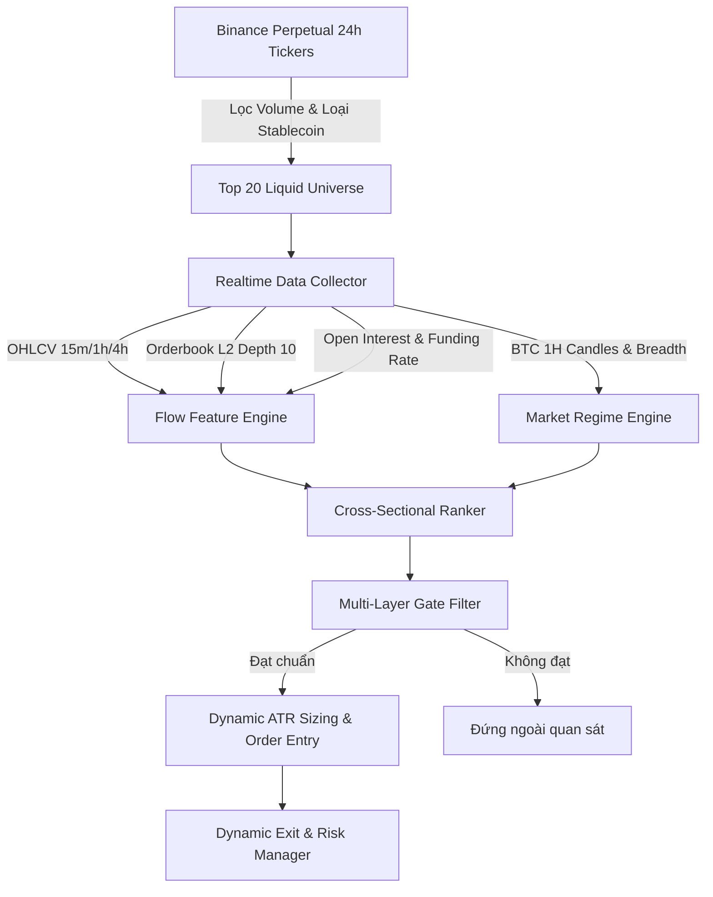
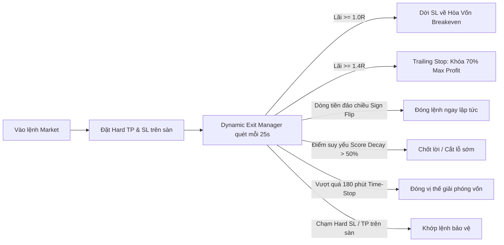

# TÀI LIỆU ĐẶC TẢ CHIẾN THUẬT AFCX (CHIẾN THUẬT 4)
### *Adaptive Flow-Centric Cross-Sectional Strategy for Crypto Perpetual Futures*

---

## 📌 TÓM TẮT ĐIỀU HÀNH (EXECUTIVE SUMMARY)

- **Tên chiến thuật:** AFCX (Adaptive Flow-Centric Cross-Sectional)
- **Thị trường mục tiêu:** Binance USDT-Margined Perpetual Futures (Hợp đồng tương lai vĩnh cửu)
- **Danh mục giao dịch (Universe):** Dynamic Top 20 Altcoins thanh khoản cao nhất theo khối lượng giao dịch 24h (loại trừ Stablecoin và các coin biến động rác).
- **Khung thời gian phân tích (Multi-Timeframe):**
  - **15 Phút (15m):** Bắt xung nhịp dòng tiền (Order Flow Imbalance - OFI, Volume Delta, Orderbook Imbalance).
  - **1 Giờ & 4 Giờ (1h, 4h):** Xu hướng trung hạn (Trend Momentum) & Chế độ thị trường (Market Regime Engine).
- **Tần suất quét & cập nhật:** Polling cycle 25 giây, bảng xếp hạng Cross-Sectional làm mới mỗi 120 giây.
- **Phong cách giao dịch:** Quantitative Systematic Trading kết hợp **Cross-Sectional Relative Momentum**, **Order Flow Divergence**, và **Dynamic Regime Switching**.

---

## I. TRIẾT LÝ VÀ LUẬN ĐIỂM GIAO DỊCH (CORE TRADING THESIS)

Chiến thuật AFCX được xây dựng dựa trên 4 nguyên lý định lượng cốt lõi:

### 1. Dòng tiền chủ động dẫn dắt biến động giá (Order Flow Precedes Price)
Giá không tự nhiên tăng hay giảm; giá dịch chuyển khi có sự mất cân bằng giữa lệnh mua chủ động (**Taker Buy**) và bán chủ động (**Taker Sell**). 
Bằng cách theo dõi tỷ lệ Taker Buy Ratio, Volume Delta, và Order Flow Imbalance (OFI) trên khung 15m kết hợp với độ sâu sổ lệnh (**Order Book Depth Imbalance L2**), hệ thống phát hiện hành vi tích lũy hoặc phân phối của dòng tiền lớn (Smart Money) trước khi nến giá bứt phá.

### 2. Sức mạnh tương đối chéo (Cross-Sectional Relative Strength)
Thay vì chỉ ngồi phân tích một coin đơn lẻ (như chỉ đánh BTC hay ETH), AFCX quan sát đồng thời một "vũ trụ" gồm 20 đồng coin có thanh khoản lớn nhất. 
Trong bất kỳ pha biến động nào của thị trường, luôn có những đồng tiền hút dòng tiền mạnh nhất (Leading Bulls) và những đồng tiền bị rút cớ dòng tiền mạnh nhất (Lagging Bears). 
Hệ thống chuẩn hóa điểm số bằng **Z-Score liên thị trường**, chỉ chọn ra **duy nhất 1 đồng coin vượt trội nhất (Top 1)** để giải ngân.

### 3. Phạt bẫy đám đông quá hưng phấn (Crowding Penalty)
Khi một đồng coin tăng giá nhưng Funding Rate quá cao (dương cực đoan) hoặc Basis (chênh lệch giá Mark Price vs Index Price) bị đẩy lên quá đà, điều đó phản ánh vị thế đòn bẩy bán lẻ (retail long) đang quá đông đúc. Đây là điều kiện hoàn hảo cho các cú "Long Squeeze" hoặc quét râu thanh lý. 
AFCX tính toán **Crowding Penalty ($C_i$)** để trừ thẳng vào điểm tín hiệu, loại bỏ các cơ hội đã quá "nóng".

### 4. Thích ứng theo Chế độ Thị trường (Adaptive Market Regime)
Thị trường crypto liên tục thay đổi trạng thái giữa:
- **TREND (Có xu hướng):** Tỷ lệ nén tốt, động lượng cao -> Hệ thống nới lỏng điều kiện vào lệnh ($|Z| \ge 1.25$).
- **RANGE (Đi ngang):** Tín hiệu giả nhiều -> Hệ thống nâng ngưỡng khắt khe hơn ($|Z| \ge 1.35$).
- **STRESS (Hỗn loạn / Biến động cực đoan):** Độ biến động vượt ngưỡng kiểm soát, thị trường sụp đổ diện rộng -> Hệ thống **khóa toàn bộ chiều mở lệnh mới** để bảo vệ tài khoản.

---

## II. KIẾN TRÚC DỮ LIỆU & UNIVERSE SELECTION

### 1. Tiêu chí sàng lọc Universe
- Lấy danh sách hợp đồng vĩnh cửu USDT-M trên sàn Binance.
- Loại trừ: USDCUSDT, FDUSDUSDT, TUSDUSDT, BUSDUSDT (Stablecoin), và các token đòn bẩy.
- Sắp xếp theo khối lượng 24h và chọn Top 20 đồng dẫn đầu.
- Tự động làm mới siêu dữ liệu (Tick size, Lot size, Min Notional) khi khởi động.

### 2. Dữ liệu thời gian thực thu thập mỗi chu kỳ:
- **Candles 15m (30 kỳ gần nhất):** Giá đóng, khối lượng, Taker Buy Base Volume.
- **Funding Rate & Basis:** Chênh lệch Mark Price và Index Price.
- **Open Interest (OI):** Giá trị hợp đồng mở hiện tại và chênh lệch so với kỳ trước ($\Delta OI$).
- **Order Book L2 (Top 10 Bids / Top 10 Asks):** Đo lường áp lực đỡ giá tức thời.
- **BTC Candles 1h (40 kỳ gần nhất):** Dùng tính Kaufman Efficiency Ratio và độ rộng thị trường (Market Breadth).

---

## III. THUẬT TOÁN TẠO TÍN HIỆU & CHUẨN HÓA ĐIỂM SỐ

Hệ thống tính toán 2 thành phần điểm số cho từng đồng coin $i$:

### 1. Điểm Định Hướng Dòng Tiền (Direction Score - $D_i$)

$$D_i = 0.20 \cdot Z(m_{1h}) + 0.15 \cdot Z(m_{4h}) + 0.25 \cdot Z(OFI_{15m}) + 0.15 \cdot Z(\Delta OI) + 0.10 \cdot Z(\text{BookImb}) + 0.10 \cdot Z(\text{RelVol}) + 0.05 \cdot \text{NetMom}$$

Trong đó:
- $m_{1h}, m_{4h}$: Động lượng giá trong 1 giờ và 4 giờ.
- $OFI_{15m}$: Order Flow Imbalance trên nến 15 phút:
  $$OFI = \frac{\text{Taker Buy Volume} - \text{Taker Sell Volume}}{\text{Total Volume}}$$
- $\Delta OI$: Xác nhận dòng tiền mới tham gia (OI Confirmation):
  $$\Delta OI = \frac{OI_{current} - OI_{prev}}{OI_{prev}}$$
  Nếu giá tăng và $OI$ tăng -> Khẳng định dòng tiền lớn mở vị thế mua chủ động.
- $\text{BookImb}$: Tỷ lệ mất cân bằng giữa lượng Bid và Ask trên 10 bậc sổ lệnh:
  $$\text{BookImb} = \frac{\sum BidVol - \sum AskVol}{\sum BidVol + \sum AskVol}$$
- $\text{RelVol}$: Khối lượng nến hiện tại so với trung bình 20 nến gần nhất (Relative Volume).
- $Z(x)$: Giá trị chuẩn hóa Z-Score chéo giữa 20 đồng coin trong cùng một thời điểm:
  $$Z(x_i) = \frac{x_i - \mu_x}{\sigma_x}$$

### 2. Điểm Phạt Đám Đông (Crowding Penalty - $C_i$)

$$C_i = 0.60 \cdot \max(0, Z(\text{FundingRate}_i)) + 0.40 \cdot \max(0, Z(\text{Basis}_i))$$

- Triệt tiêu bớt điểm số của các coin có Funding Rate hoặc chênh lệch Basis quá cao so với mặt bằng chung của thị trường.

### 3. Điểm Xếp Hạng Tổng Hợp (Final Score - $S_i$)
- Khi tìm cơ hội **LONG**: $S_i = D_i - C_i$
- Khi tìm cơ hội **SHORT**: $S_i = D_i + C_i$
- Chuẩn hóa Z-Score toàn bộ $S_i$ của 20 coin. Đồng có $|Z(S_i)|$ cao nhất sẽ là **Ứng viên Top 1**.

---

## IV. BỘ LỌC CỔNG ĐA TẦNG (MULTI-LAYER GATE FILTERS)

Ngay cả khi một đồng coin đứng Top 1 bảng xếp hạng, nó vẫn phải vượt qua **4 cổng kiểm duyệt nghiêm ngặt** trước khi bot gửi lệnh vào sàn:

| Cổng lọc | Tiêu chí kiểm duyệt | Mục đích bảo vệ |
|:---|:---|:---|
| **1. Regime Gate** | Khóa giao dịch nếu thị trường rơi vào `STRESS`. Nếu `RANGE`, nâng ngưỡng kích hoạt lên $|Z| \ge 1.35$. | Tránh giao dịch khi thị trường sụp đổ diện rộng hoặc biến động nhiễu. |
| **2. Confidence Gate** | Hiệu số điểm giữa Top 1 và Top 2 phải thỏa mãn: $\Delta Z = \|Z_1\| - \|Z_2\| \ge 0.20$. | Loại bỏ các tín hiệu phân vân khi dòng tiền chưa có sự phân hóa rõ ràng. |
| **3. Consensus Gate** | Tối thiểu 4 trên 6 chỉ báo cấu thành phải đồng thuận cùng hướng với tín hiệu. | Tránh bẫy lệch pha giữa các khung thời gian (ví dụ: 15m tăng nhưng 1h & 4h đang downtrend nặng). |
| **4. Cost Gate (TCA)** | Lợi nhuận kỳ vọng ròng (Expected Edge) phải lớn hơn **2.5 lần** tổng chi phí giao dịch (phí Taker 2 chiều + trượt giá ước tính). | Đảm bảo mỗi lệnh mở đều có kỳ vọng toán học dương sau khi trừ hết chi phí sàn. |
| **5. Session Filter** | Chỉ giao dịch trong phiên có thanh khoản cao nhất: **08:00 - 21:00 UTC** (tức **15:00 - 04:00 giờ Việt Nam**). | Tránh các đợt biến động mỏng, quét thanh khoản vô tội vạ vào phiên Châu Á. |
| **6. Post-Trade Cooldown** | Sau khi một lệnh đóng, hệ thống dừng quét mở lệnh trong **10 phút**. | Ngăn chặn việc nhảy vào bắt dao rơi ngay sau cú giật mạnh của thị trường. |

---

## V. QUẢN TRỊ VỊ THẾ & CƠ CHẾ THOÁT LỆNH ĐỘNG (DYNAMIC EXIT)

Chiến thuật áp dụng mô hình thoát lệnh 2 lớp: **Lớp Bảo vệ Cứng (Exchange Hard Orders)** và **Lớp Thoát Lệnh Thông Minh (Dynamic In-Flight Manager)**.

### 1. Thiết lập Bảo vệ Ban đầu (Hard TP/SL Orders)
- **Stop Loss ban đầu:** Tính toán động theo $1.2 \times \text{ATR}(14)$ của nến 15m (kẹp trong khoảng an toàn $0.35\% \le SL \le 1.50\%$).
- **Take Profit ban đầu:** Tỷ lệ Risk-Reward cơ bản cố định $1 : 1.8$ ($TP = 1.8 \times SL$).
- Cả hai lệnh này được gửi trực tiếp lên Binance dưới dạng `STOP_MARKET` và `TAKE_PROFIT_MARKET` để bảo vệ tài khoản ngay cả khi mất điện hoặc rớt mạng.

### 2. Thoát lệnh Động (Dynamic Exit In-Flight)
Mỗi 25 giây, module `DynamicExitManager` đánh giá lại vị thế đang chạy:
1. **Breakeven Protection:** Khi lợi nhuận đạt $\ge 1.0R$, tự động dời Stop Loss về giá hòa vốn (entry price + phí).
2. **Dynamic Trailing Stop:** Khi vị thế đạt lợi nhuận $\ge 1.4R$, kích hoạt trailing stop bảo lưu tối thiểu 70% mức lợi nhuận đỉnh cao nhất đạt được.
3. **Score Decay Exit:** Nếu điểm Alpha Score của đồng coin đó giảm hơn 50% so với thời điểm vào lệnh hoặc đồng coin rớt khỏi Top 5 của bảng xếp hạng, bot đóng lệnh sớm để bảo toàn vốn.
4. **Sign Flip Exit:** Nếu $OFI_{15m}$ hoặc chiều dòng tiền bị đảo ngược hoàn toàn (ví dụ: đang Long nhưng Taker bán ồ ạt xuất hiện), lệnh được đóng Market ngay lập tức mà không cần chờ chạm SL.
5. **Time-Based Stop:** Nếu sau 3 giờ (180 phút) vị thế vẫn đi ngang và chưa chạm TP/SL, hệ thống sẽ tự động đóng vị thế để giải phóng ký quỹ cho cơ hội mới.

---

## VI. QUẢN TRỊ RỦI RO & HẠ TẦNG VẬN HÀNH (RISK & INFRASTRUCTURE)

1. **Vận hành Daemon 24/7:**
   - Chạy ngầm liên tục trên Linux Server, quản lý bằng PID file, tự động bắt tín hiệu tắt máy (`SIGTERM`, `SIGINT`) để hủy lệnh chờ an toàn trước khi dừng.
2. **Cơ chế Dọn dẹp Lệnh Treo Mồ Côi (Zero-Orphan Reconciler):**
   - Định kỳ kiểm tra đồng bộ vị thế giữa máy chủ và sàn Binance. Nếu vị thế đã đóng (do dính SL/TP) mà lệnh đối ứng còn treo, hệ thống tự động hủy ngay lập tức để tránh khớp lệnh ngoài ý muốn.
3. **Bộ ngắt mạch khẩn cấp (Circuit Breaker / Kill Switch):**
   - Giới hạn lỗ tối đa trong ngày: $3.0\%$.
   - Giới hạn Drawdown tối đa tổng tài khoản: $6.0\%$.
   - Nếu chạm một trong hai ngưỡng trên, hệ thống đóng toàn bộ vị thế, hủy toàn bộ lệnh và khóa bot.
4. **Kiểm soát Tỷ lệ Ký quỹ & Đòn bẩy:**
   - Đòn bẩy mặc định: $5\times$.
   - Tối đa 1 vị thế mở tại một thời điểm (đơn nhiệm tập trung) để tránh rủi ro tương quan chéo khi Bitcoin biến động lớn.

---

## VII. BỘ CÂU HỎI MỜI PHẢN BIỆN DÀNH CHO CÁC CHUYÊN GIA (EXPERT REVIEW QUESTIONS)

*Kính gửi các Senior Quant Trader / Researcher, sau khi đọc kiến trúc của chiến thuật AFCX, rất mong nhận được ý kiến đóng góp và phản biện chuyên sâu về các khía cạnh sau:*

1. **Về Ma Trận Trọng Số Tính Điểm (Weighting Scheme):**
   - Hiện tại trọng số $D_i$ đang cố định: 20% Mom 1h, 15% Mom 4h, 25% OFI 15m, 15% OI, 10% Book Imbalance, 10% RelVol, 5% Net Mom.
   - *Theo kinh nghiệm của bạn, việc sử dụng trọng số tĩnh này có dễ bị overfitting không? Có nên thay thế bằng Rolling Ridge Regression hoặc Principal Component Analysis (PCA) để trọng số tự co giãn theo thời gian thực không?*

2. **Về Rủi Ro Tương Quan Chéo Khi BTC Giật Mạnh (Correlation Collapse):**
   - Trong thị trường Crypto, khi Bitcoin biến động mạnh (giảm đột ngột 3-5% trong 15 phút), toàn bộ Altcoins đều có xu hướng giảm theo bất kể dòng tiền nội tại trước đó mạnh đến mức nào.
   - *Giải pháp tối ưu để trung hòa Beta (Beta-Neutralization) trong trường hợp này là gì? Có nên mở vị thế Short BTC đối ứng (Hedging) khi Long một Altcoin Top 1 không?*

3. **Về Chỉ Báo Order Flow Imbalance (OFI) & Thanh Khoản Altcoins:**
   - Trên các Altcoin ngoài Top 5 (như APT, NEAR, SUI, v.v.), dữ liệu Orderbook L2 và Taker Volume có độ nhiễu khá cao do các Market Maker sử dụng thuật toán Spoofing / Iceberg orders.
   - *Làm thế nào để lọc nhiễu tốt nhất cho chỉ báo Book Imbalance và OFI đối với nhóm Altcoins này?*

4. **Về Khung Thời Gian Giữ Lệnh (Holding Period):**
   - Hiện tại chiến thuật giữ lệnh trung bình từ 30 phút đến 3 giờ. Với tần suất này, chi phí phí Taker (0.04% - 0.05% mỗi chiều) là một rào cản lớn.
   - *Liệu chiến thuật này nên tối ưu sang Maker Entry (Post-Only) bằng Limit Order tại vùng hỗ trợ vi mô (micro-support) hay tiếp tục dùng Market Order để đảm bảo tính kịp thời của tín hiệu dòng tiền?*

---
*Tài liệu được xuất tự động từ hệ thống Crypto Quant Lab — Chiến thuật AFCX v2.4 Production.*
